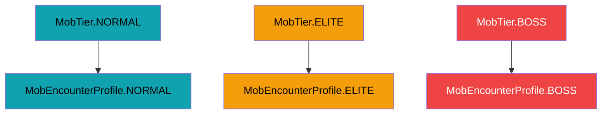
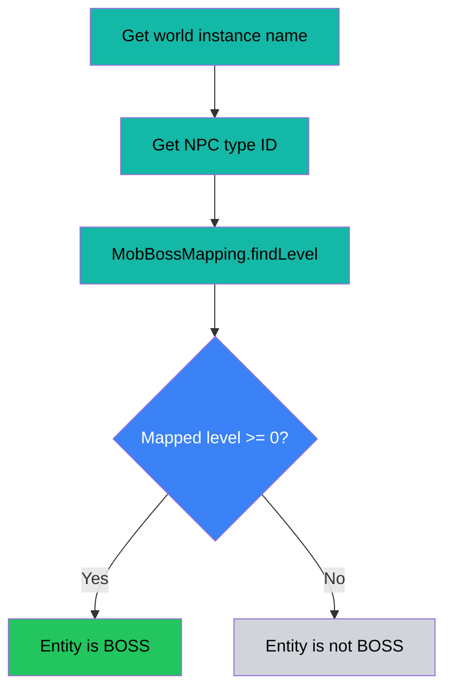
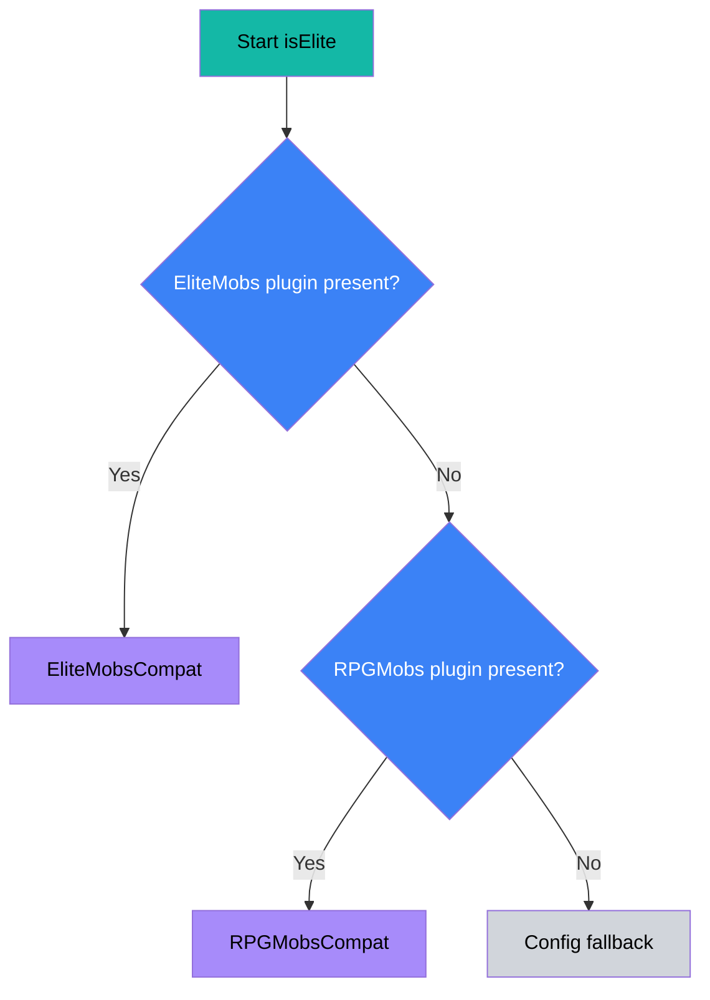
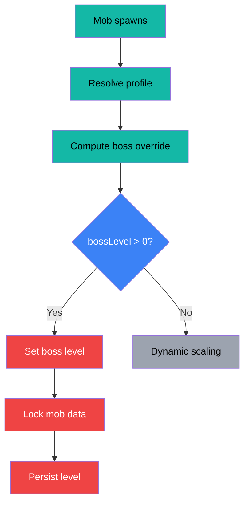
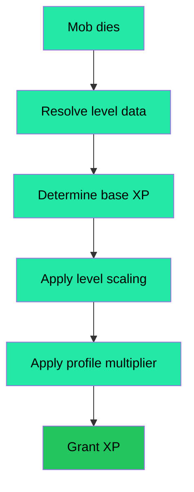
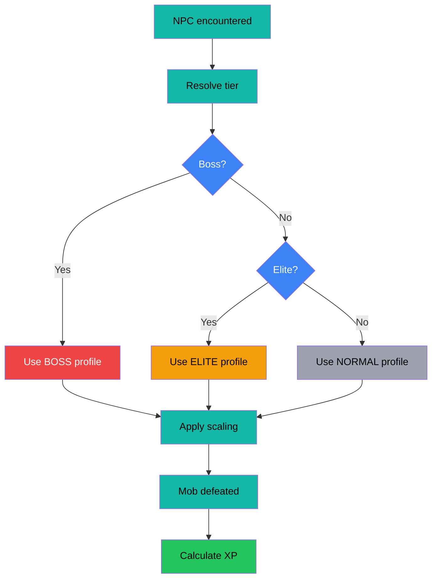

# Elite and Boss Entity Mapping

This page explains how Elite and Boss entities are determined and mapped within the LevelingCore system, including how tiers are resolved, how boss mappings work, and how they influence leveling and XP systems.

---

## Overview

Mob classification is handled through three tiers:

- **NORMAL**
- **ELITE**
- **BOSS**

These tiers directly determine which `MobEncounterProfile` is applied, affecting:

- Health scaling
- Damage scaling
- XP rewards

---

## Mob Encounter Profiles

Each tier maps to a predefined profile:

| Tier   | Profile                      | Description          |
|--------|------------------------------|----------------------|
| NORMAL | `MobEncounterProfile.NORMAL` | Baseline mob stats   |
| ELITE  | `MobEncounterProfile.ELITE`  | Increased difficulty |
| BOSS   | `MobEncounterProfile.BOSS`   | Highest difficulty   |

Profiles define multipliers:
- Health
- Damage
- Damage threshold
- XP multiplier

These values are pulled from the configuration at runtime.

### Mermaid: Profile Mapping



---

## Boss Mapping System

Bosses are determined by a **CSV-driven mapping system**.

### File Location

```text
/mods/com.azuredoom_levelingcore/data/config/mobbossmapping.csv
```

### Format

```csv
instance,boss_name,lvl
```

### Example Boss Mapping Config

```csv
# Exact instance match
dungeon_fire,fire_dragon,50

# Wildcard instance match
raid_*,ancient_guardian,75
```

### How It Works

- Instance name + NPC type ID are matched
- Supports wildcard matching (`*`)
- Most specific match wins

```java
MobBossMapping.findLevel(rules, instanceName, bossName)
```

If:
- A match is found → the entity is a **BOSS**
- No match → not a boss

### Mermaid: Boss Mapping Lookup



---

## Boss Detection Logic

From resolver:

```java
int mappedLevel = MobBossMapping.findLevel(...);
return mappedLevel >= 0;
```

Key points:

- Boss status is **data-driven**
- Level is also derived from mapping
- Invalid or missing mappings return `-1` fileciteturn0file1turn0file3

---

## Elite Detection Logic

Elite detection supports multiple sources:

1. **EliteMobs plugin**
2. **RPGMobs plugin**
3. **Fallback config list**

```java
if (EliteMobs installed) → use compat
else if (RPGMobs installed) → use compat
else → config.isEliteMob(...)
```

### Mermaid: Elite Detection



---

## Integration with Mob Level System

The resolved profile and tier feed into:

**MobLevelSystem**

### Key Behavior

- Tier determines scaling multipliers
- Boss mappings can **override level and lock it**

```java
var bossLevel = computeBossOverrideLevel(...);
if (bossLevel > 0 && !data.locked) {
    data.level = bossLevel;
    data.locked = true;
}
```

Implications:

- Bosses ignore dynamic scaling after assignment
- They retain a fixed difficulty
- Locked boss levels are persisted for consistency

### Mermaid: Level Override Flow



---

## XP Scaling Impact

XP calculation is influenced by:

- Mob level
- Profile XP multiplier
- Config multipliers

### Simplified Formula

```text
XP = base * (level^multiplier) * (xpMultiplier^multiplier)
```

Where:
- `base` comes from either configured XP mappings or health-derived XP
- `level` comes from the resolved mob level
- `xpMultiplier` comes from the encounter profile (NORMAL / ELITE / BOSS) fileciteturn0file5

### Mermaid: XP Calculation Flow



---

## End-to-End Flow



---
