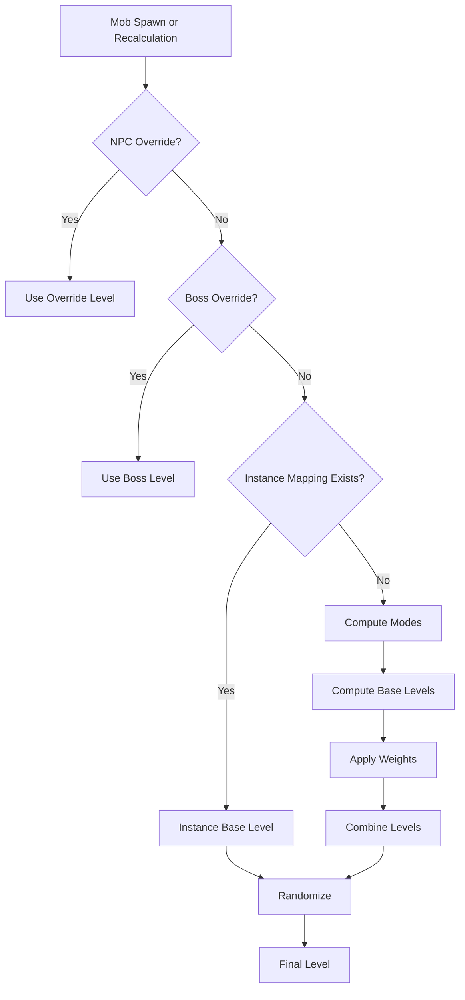

The Mob Leveling system dynamically assigns and updates levels for NPC mobs based on configurable rules, world context, and player influence.

## Level Pipeline

```mermaid
flowchart TD
    A[Mob Spawn or Recalculation] --> B{NPC Override?}
    B -- Yes --> B1[Use Override Level]
    B -- No --> C{Boss Override?}
    C -- Yes --> C1[Use Boss Level]
    C -- No --> D{Instance Mapping Exists?}

    D -- Yes --> D1[Instance Base Level]
    D -- No --> E[Compute Modes]

    E --> F[Compute Base Levels]
    F --> G[Apply Weights]
    G --> H[Combine Levels]

    D1 --> I[Randomize]
    H --> I

    I --> L[Final Level]
```
