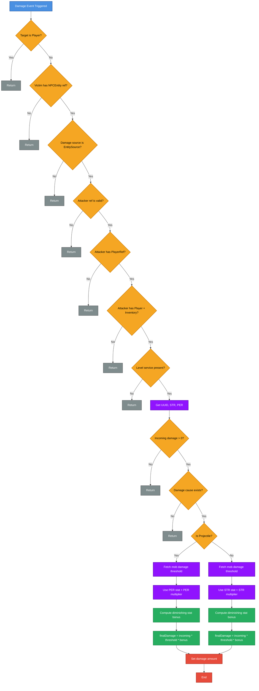
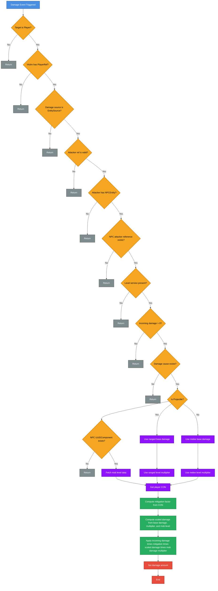

# Overview

Players gain **Ability Points** through leveling. These points can be
spent to increase one of several core stats.\
Spending a stat immediately updates derived values such as health,
stamina, mana, and combat damage.

- Use `/showstats` or the **Tome of Skills** to allocate points.
- Use the **Reset Skills Potion** to refund all spent points.
- After spending a stat point, Health, Stamina, and Mana are recalculated and immediately restored to their new maximum values.

## Stat Effects at a Glance

- **STR** — increases melee damage
- **AGI** — increases stamina and oxygen
- **PER** — increases projectile damage
- **VIT** — increases maximum health
- **INT** — increases maximum mana and mana regeneration
- **CON** — reduces incoming damage

## Spending Ability Points

A player can spend Ability Points by using the command `/showstats` or using the new Tome of Skills, which can be crafted like so:


| Ingredient   | Amount |
|--------------|--------|
| Life Essence | 5      |

### HyUI Version


### Vanilla UI / No HyUI


## Resetting Ability Points

A player can reset their Ability Points by crafting the `Reset Skills Potion` found in the `Alchemy bench`


| Ingredient    | Amount |
|---------------|--------|
| Potion Bottle | 1      |
| Water Bucket  | 1      |
| Life Essence  | 5      |
| Fire Essence  | 5      |
| Ice Essence   | 5      |
| Void Essence  | 5      |
| Water Essence | 5      |
| Apple         | 2      |

## Derived Stats

### Vitality (VIT) – Maximum Health

Increases **Maximum Health**.

```
Health Bonus = VIT × vitStatMultiplier
```

-   Default multiplier: `2.0`

### Agility (AGI) – Maximum Stamina and Oxygen

Increases **Maximum Stamina** and **Maximum Oxygen**.

```
Stamina Bonus = AGI × agiStatMultiplier
Oxygen Bonus  = AGI × agiStatMultiplier
```
-   Default multiplier: `0.25`

### Intelligence (INT) – Maximum Mana

Increases **Maximum Mana** and **Mana Regeneration**.

    Mana Bonus = INT × intStatMultiplier
    Mana Regen = max(1, floor(1 + INT × 0.25))

-   Default multiplier: `2.0`

## Combat Calculations



### Strength (STR) – Melee Damage

Applied when the player performs a **melee attack**.

    Final Damage = Base Damage × (1 + STR × strStatMultiplier)

-   Default multiplier: `0.1`

### Perception (PER) – Ranged Damage

Applied when the player performs a **projectile attack**.

    Final Damage = Base Damage × (1 + PER × perStatMultiplier)

-   Default multiplier: `0.1`

### Constitution (CON) – Damage Taken

Applied when the player **receives damage**.

    Final Damage =
      Incoming Damage
      × conDamageMultiplier(CON)
      × Weapon Type Multiplier
      × Mob Level Multiplier

-   Applies to both melee and projectile damage
-   Lower final values mean less damage taken
-   Default base multiplier: `0.80`



## Configuration Defaults

``` yaml
strStatMultiplier: 0.1
perStatMultiplier: 0.1
vitStatMultiplier: 2.0
agiStatMultiplier: 0.25
intStatMultiplier: 2.0
conStatMultiplier: 0.80
```

All multipliers are configurable for balance tuning.

## Recalculation Behavior

After a stat is spent:

-   Health, Stamina, and Mana maximums are recalculated
-   Health, Stamina, and Mana are automatically **set to their new
    maximums**
-   Mana regeneration is updated immediately
-   Stat modifiers are applied as **additive max-value modifiers**